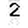

# Invoice OCR Extraction Project

## Purpose
The project focuses on extracting Optical Character Recognition (OCR) from specific parts of invoices that carry important information. The regions of interest (ROIs) are defined by the user and include crucial details such as the invoice number, date, total amount, and the cost of the second product.


## Table of Contents
1. [Brief Overview](#overview)
2. [About Me](#about-me)
3. [Project Flow](#project-flow)
4. [PyTorch Model Architecture](#pytorch-model-architecture)
5. [Training Experiments](#training-experiments)
6. [Deployment Needed Modules and files](#deployment-needed-modules-and-files)
7. [Technologies Used](#technologies-used)
8. [Improvements](#improvements)


<a id="overview"></a>

## Brief Overview
This OCR Web Application uses a pre-trained OCR model to extract text from images. It allows users to upload image files and view the extracted text directly within the web interface. The app supports both scanned documents and images with text.

### Example 1: Website Welcoming Page


### Example 2: Website Image Uploading


### Example 2: Website Prediction Page


<a id="about_me"></a>

## About Me

I am an Artificial Intelligence (AI) engineer with a strong passion for leveraging machine learning and deep learning techniques to solve real-world problems. With a solid academic background in AI and extensive hands-on experience, I specialize in computer vision, natural language processing, and developing end-to-end solutions for both research and practical applications.

This OCR Web Application is a testament to my commitment to creating innovative tools that enhance productivity and accessibility. Through this project, I aim to empower users to efficiently extract meaningful text from image invoices, making information processing faster and more reliable.

I believe in continuous learning and enjoy exploring new technologies, collaborating with diverse teams, and contributing to the AI community. Outside of work, I am passionate about staying up-to-date with the latest trends in AI, reading, and working on personal projects.

If you have any questions or would like to collaborate, feel free to reach out to me at [desham8@gmail.com](mailto:email@example.com).


<a id="project_flow"></a>

## Project Flow

### 1. Google Drive Integration
The project starts with an image being uploaded to a tracked Google Drive repository using Python and OAuth. The `google_drive_update_tracker.py` module is used to track uploaded files and download the new ones to the `data/invoices` folder.

### 2. Region of Interest Selection
The `get_data_coordinates.py` script is used to select regions of interest (ROIs) on the invoice image. The user selects the areas by clicking on the image, where each two clicks represent a rectangular ROI and if he mistakely clicked, he can easily removes the last inserted point by pressing on `n`. The coordinates are saved in a `data/coordinates_data.json` file.

### 3. ROI Cropping
The `crop_ROIs.py` script takes the saved coordinates and the invoice image to crop the selected regions of interest. These cropped images, containing important data (invoice number, date, total amount, second product cost), are saved in the `data/cropped_rois` directory.

### Examples of ROI Image Crops


### 4. ROI processing
The `image_processing.py` script takes the saved rois from the `data/cropped_rois` and apply the required processing in it to prepare it for being used by the ocr tesseract model.

### Examples of processed ROI Crops


### 5. OCR with Tesseract
For extracting information such as dates and English letters, Tesseract OCR is used with `eng` or `ara` models. However, the performance of Tesseract is limited when extracting Arabic digits, requiring some additional steps.


### 6. Arabic Digit Extraction using Tesseract
To improve OCR accuracy for Arabic digits, a custom Tesseract model was trained using 21 classes for the Arabic digits ('٠' to '٩') and their English counterparts plus the slash "/". However, Tesseract performed suboptimally, I trained it only with 2000 samples as my whole dataest for all classes, it gives moderate accuracy but I think It should works better with enougth data samples, so a PyTorch-based model was developed to handle Arabic digit recognition for now.

### Examples of custom tesseract model accuracy

comparing it with real data that shown in the ROI crops above say that it can do better with larger training dataset.


### 7. Data Annotation and Generation
The process of annotating the digits for training was automated using scripts:
- `data_class_generator_augmentor.py`: Generates augmented images for training.
- `image_concatenator.py`: Concatenates images for each class.
- `tesseract_auto_labeler.py`: Automatically generates labels for the image data.
- `combine_images_label_boxes.py`: Ensures that images and their corresponding annotations are paired.

### Example 1: All Classes Concatenated Sample Data


### Example 2: Data Combined with Label Boxes in `JtessBoxEditor`

the above labels are generated using the `tesseract_auto_labeler.py` script.

### 8. PyTorch Model for Arabic Digit Recognition
A lightweight custom PyTorch model was created to handle Arabic digit recognition. The model is based on a Convolutional Neural Network (CNN) architecture. It consists of three convolutional layers followed by two fully connected layers. The model utilizes max pooling, ReLU activations, and dropout for regularization.


<a id="pytorch_model_architecture"></a>

## PyTorch Model Architecture

```python
class OCRModel(nn.Module):
    def __init__(self, num_classes=10):
        super(OCRModel, self).__init__()
        self.conv1 = nn.Conv2d(3, 32, kernel_size=3, stride=1, padding=1)
        self.conv2 = nn.Conv2d(32, 64, kernel_size=3, stride=1, padding=1)
        self.conv3 = nn.Conv2d(64, 128, kernel_size=3, stride=1, padding=1)
        self.fc1 = nn.Linear(128 * 4 * 4, 512)
        self.fc2 = nn.Linear(512, num_classes)
        self.pool = nn.MaxPool2d(kernel_size=2, stride=2, padding=0)
        self.dropout = nn.Dropout(0.5)

    def forward(self, x):
        x = self.pool(torch.relu(self.conv1(x)))
        x = self.pool(torch.relu(self.conv2(x)))
        x = self.pool(torch.relu(self.conv3(x)))
        x = x.view(-1, 128 * 4 * 4)
        x = torch.relu(self.fc1(x))
        x = self.dropout(x)
        x = self.fc2(x)
        return x
```

<a id="training_experiments"></a>

## Training Experiments

### 9. Training Process
Initially, the model was trained with 5000 samples per Arabic digit class. The accuracy was good, but issues arose when distinguishing between similar digits such as '٥' and '.' or '٦' and '٩'. To improve the model's accuracy, additional creative data generation techniques were applied, including using handwritten English 0 digits and other variations. After additional training and experimentation, the model showed an accuracy of 95.8%, but the issues with '٦' and '٩' persisted.


### Loss Plot for Pytorch model using 5k training generated examples


### Loss Plot for Pytorch model using 5k creative data


### Loss Plot for Pytorch model using 10k training generated examples


A final version of the model was trained with 10,000 image samples per class and saved as a TorchScript model for stable deployment.

### 10. Splitting the Numbers into Digits
The `number_to_digits_splitter.py` script splits the ROI images containing numbers into individual digits to improve the performance of the classification model. The split digits are saved in `data/image_number_to_splitted_digits`.

### Examples of numbers or sequence of OCR splitted into digits using `number_to_digits_splitter.py`





### 11. Summary
The project combines Tesseract OCR for English text and a custom PyTorch model for Arabic digit recognition. The PyTorch model was developed to handle the complexities of Arabic digit extraction and improve the overall accuracy.

### 12. Trials and Issues

- **Arabic OCR Model**: Tesseract's Arabic OCR model was not fast enough and required a GPU for optimal performance.
- **EasyOCR**: EasyOCR also provided poor accuracy for Arabic digits.
- **Digit Confusion**: The main issue during the training was the confusion between similar Arabic digits ('٦' and '٩') and English digits (such as '.' and '٥').

### 13. Current Status and Future Work
The project is still under development, focusing on resolving the digit confusion problem. The PyTorch model continues to improve with ongoing data collection and model training.

### 14. Concluding Remarks
This OCR extraction project aims to streamline invoice data extraction by using advanced OCR techniques for both English and Arabic characters. The model is continually being improved to achieve better performance and accuracy.


<a id="website_walkthough"></a>

## Deployment Needed Modules and files

- `config.py`: Contains a dictionary of keys and the corresponding paths for dynamic path update with different devices.

- `google_drive_update_tracker_admin.py`
    - Tracks and downloads newly uploaded files from a specified Google Drive folder.
    - **Authentication**: Uses **Service Accounts** from Google Cloud Services.
    - **Use Case**: Ideal for **server-side administration**, where the application requires continuous, programmatic access to shared or system-specific Drive resources without user intervention.

-  `google_drive_update_tracker.py`
    - Tracks and downloads newly uploaded files from a specified Google Drive folder.
    - **Authentication**: Uses **OAuth 2.0 Credentials** from Google Cloud Services.
    - **Use Case**: Designed for **end-user connections**, allowing users to log in with their Google accounts via a secure OAuth 2.0 flow to access their personal or shared Drive folders.

## Key Differences

| Feature                     | **Service Accounts**                                 | **OAuth 2.0 Credentials**                      |
|-----------------------------|----------------------------------------------------|-----------------------------------------------|
| **Purpose**                 | Server-side, programmatic access                   | End-user authentication and access            |
| **Authentication Flow**     | JSON key file, no user interaction required        | User login via browser with OAuth consent     |
| **Access**                  | Limited to shared resources                        | Full access to user-granted resources         |
| **Use Case**                | Automation, shared system resources                | Personal, user-specific workflows             |


- `coordinates_data.json`: Generated using `get_data_coordinates.py`. Allows the user to select regions of interest from the invoice images.

- `crop_ROIs.py`: Crops the regions of interest based on the selected coordinates.

- `image_processing.py`: Prepares images for OCR English digits processing.

- `number_to_digits_splitter.py`: Splits numbers into individual digits.

- `invoice_extraction_models.py`: call the tesseract and the pytorch model for OCR.

- `main.py`: gather all the above code.

- `fastapi_postman.py`: Designed for use with Postman, this version delivers pure JSON responses without any embedded HTML code.

- `fastapi_deployment.py`: A more professionally deployed version featuring an HTML and CSS layout, interactive buttons, and a well-presented display of results.


### Example of Invoice Image to Upload


### Example of Predicted message when Uploading the Invoice


### Example of Postman Response From fastapi without html template


### Example of Postman Response From fastapi with html template


<a id="technologies_used"></a>

## Technologies Used  

### Libraries and Frameworks  
- **Tesseract OCR**: Extracts text from images, focusing on English digit recognition.  
- **PyTorch**: Enhances OCR accuracy and digit classification with deep learning models.  
- **FastAPI**: Backend framework for deploying the OCR application with JSON API endpoints and an interactive web interface.  
- **OpenCV**: Handles image preprocessing, including cropping regions of interest (ROIs) and preparing images for OCR.  
- **NumPy**: Performs numerical computations for image processing and data handling.  
- **Matplotlib**: Visualizes results and assists in debugging image-based processes.  

### Deployment Tools  
- **Postman**: Tests and validates API endpoints, analyzing pure JSON responses.  

### Version Control  
- **Git**: Manages versioning and tracks project changes.  

### Others  
- **JSON**: Serves as the format for API responses and data exchange.  
- **config.py**: Manages dynamic path configuration and module integration.  


<a id="improvements"></a>

## Improvements

### Performance Enhancements  
- **Model Optimization**: Fine-tune the PyTorch model to achieve faster inference and higher accuracy.  
- **Parallel Processing**: Leverage multi-threading or GPU acceleration to process multiple images simultaneously.  
- **Error Handling**: Implement robust error-handling mechanisms to deal with incomplete or low-quality images.  

### Functional Upgrades  
- **Language Support**: Extend OCR capabilities to handle multiple languages in addition to English digits.  
- **Dynamic ROI Selection**: Allow users to dynamically select regions of interest through the web interface.  
- **Customizable Output**: Provide options for exporting results in different formats, such as Excel, PDF, or CSV.  

### Deployment Enhancements  
- **Scalable Deployment**: Use Docker and Kubernetes for scalable and containerized deployments.  
- **Cloud Integration**: Integrate with cloud services like AWS S3 for storing and retrieving images and results.  
- **Authentication and Security**: Add user authentication to restrict access and ensure secure API usage.  


